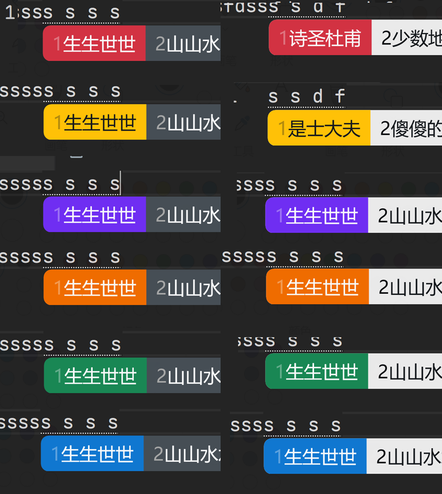

# 小狼毫（Rime）输入法样式——小胶囊系列

## 主题颜色

rime 输入法使用的主题，整体呈一个紧凑的胶囊形状，分亮色暗色两种
有如下若干种颜色

- 小胶囊红（分亮色暗色）
- 小胶囊黄（分亮色暗色）
- 小胶囊紫（分亮色暗色）
- 小胶囊橙（分亮色暗色）
- 小胶囊绿（分亮色暗色）
- 小胶囊蓝（分亮色暗色）

## 示例图片

以下是主题的示例图片：

  

## 在线预览

- GitHub Pages: <https://baendlorel.github.io/rime-theme-compact-capsule/>

## 使用方法

1. 进入 `dist` 文件夹
2. 复制 `patch_weasel.custom.yaml` 中 `patch:` 下的内容
3. 粘贴至`用户文件夹`中的 `weasel.custom.yaml` 对应位置
4. `patch_default.custom.yaml`同理，它是用于：
   - 改用 CapsLock 切换中英文
   - 设置候选词数量为 6

## 配置细节

- 候选词框背景不透明度：90%
- 候选词方向：水平排列
- 边距调整：胶囊状紧凑样式
- 圆角半径：自定义调整
- 预编辑区：启用行内显示
